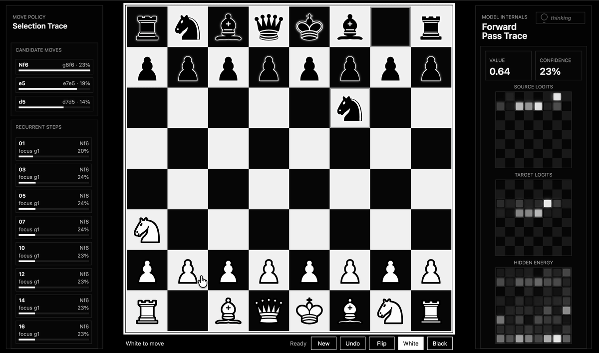
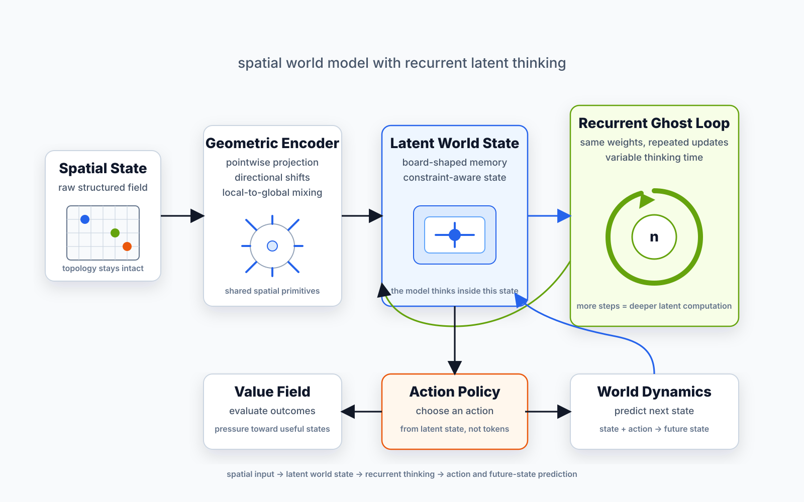

# Void: Sequence Modeling Architecture 
The foundational architecture: gravitational shifts, tensor contractions, and latent recurrence for continuous-domain sequence modeling.
VOID is a spatial world-model architecture. 
Chess is one benchmark variation of it: a compact testbed for latent spatial reasoning, action prediction, and active-inference-style policy learning.

This chess instantiation operates directly on board tensors and moves, not text notation or rendered pixels. In current pre-RL benchmarks, The model shows high variance in capabilities demonstrating something fascinating where it wins a small percentage of games against high elo like stockfish 2500 as well. This suggests that it does not act like a generic chess engine. RL is the probable solution for this, the estimated elo is around 1600; the next stage is reinforcement learning.

Play the hosted demo: [chess.eigenesis.org](https://chess.eigenesis.org)





## Core Idea

VOID is built around one bet: for spatial intelligence, geometry should be part of the computation itself instead of something the model has to rediscover from token positions.

The model operates directly on continuous spatial tensors. In the chess benchmark, the input is an `8x8` board tensor with piece, turn, and state planes. There is no text notation, rendered pixel input, or patch tokenization step. The board remains a board throughout the network.

The core operation is geometric shift + contraction:

```text
spatial tensor -> directional shifts -> tensor contractions -> latent spatial map
```

Each block uses `torch.roll` to move information across the grid in the center, orthogonal, and diagonal directions. A north shift, diagonal shift, or file/rank shift is not represented as an abstract token relationship; it is literally a movement of information across the spatial field. The shifted views are then mixed with learned tensor contractions using `einsum`.

This gives VOID a strong spatial inductive bias:

- local relations are available immediately through directional shifts
- longer-range relations emerge by stacking blocks and recurrent steps
- board topology is preserved instead of flattened into a sequence
- the same mechanism applies to grids, games, depth maps, constraint fields, and other continuous spatial states

After encoding, VOID runs a shared recurrent **ghost loop** over the latent map. The same weights are reused at each thinking step, so the model can spend more compute without adding more parameters. In practice, increasing `n_think` lets the same model refine its internal state before choosing an action.

This makes VOID closer to a spatial world model than a standard feedforward policy. It does not only map `state -> action`; it maintains a latent spatial state, iterates on it, predicts action consequences, and uses those imagined futures during inference.

## Architecture

The chess benchmark uses this VOID core with several heads on top:

- `from_square` and `to_square` policy heads for spatial action prediction
- a value head for outcome estimation
- a legality head for move-validity pressure
- an action-conditioned transition head for `board + move -> next board`
- a terminal-distance head for conversion pressure in endgames

The transition head turns the model into an explicit world model. Given a candidate move, it predicts the next board tensor in the same spatial representation. This forces the latent state to learn chess physics: piece movement, captures, turns, castling, and board transitions.

## World Model + Active Inference

The chess variant is trained not only to imitate strong moves, but also to model the consequences of actions. This adds a chess-physics objective alongside policy learning: pieces, turns, captures, and transitions must become part of the latent dynamics.

The policy is active-inference-style: the model refines an internal latent state, evaluates possible action pressure through value and terminal-distance heads, and learns to prefer moves that lead toward better future states. In endgames, the terminal-distance objective adds conversion pressure, encouraging the model to resolve winning positions instead of only predicting that they are good.

## Inference

The default player can act directly from the policy head: board state in, ranked legal moves out. The hosted demo also includes **Imagine mode**, an energy-rollout world-model player.

In Imagine mode, the model evaluates candidate legal moves by rolling them forward through its learned world model:

```text
candidate move -> imagined opponent reply -> imagined follow-up
```

The imagined line is scored with a learned energy objective that combines the policy prior, future value, rollout confidence, material pressure, and terminal-distance pressure. This keeps the policy grounded while letting the world model prefer futures that look stronger after imagined consequences.

In current head-to-head benchmark runs, Imagine mode consistently outperforms the direct policy player.

## Curriculum

The chess benchmark is trained as a staged curriculum:

1. Tactics from Lichess puzzles
2. Foundation training on strong human games
3. Opening positions
4. Middlegame positions
5. Endgame positions
6. Optional reinforcement learning against Stockfish

Later phases mix in replay from earlier data so the model does not forget tactics and full-game behavior while specializing. The current checkpoint is pre-RL; reinforcement learning is the next step.

## Files

- `void.py` contains the model architecture.
- `train.py` contains the curriculum trainer, cache builders, held-out evaluation, and benchmark logic.
- `void_architecture.svg` is a compact architecture diagram.
- `chess.gif` shows the chess benchmark variant playing.

## Example

```bash
python train.py \
  --phase 1 \
  --stop-after-phase 1 \
  --all-steps \
  --use-gm-cache \
  --gm-cache-samples 10000000 \
  --phase12-batch 768 \
  --num-workers 4
```

Checkpoints and dataset caches are intentionally not included in this repository.
